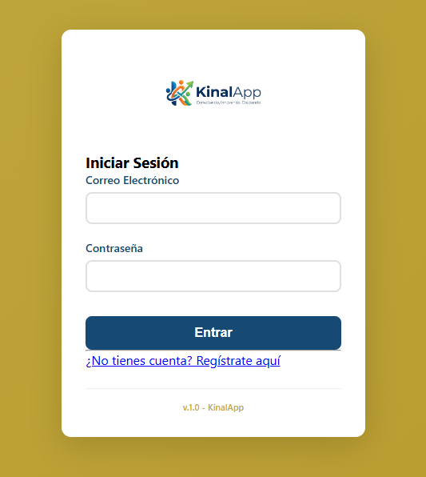
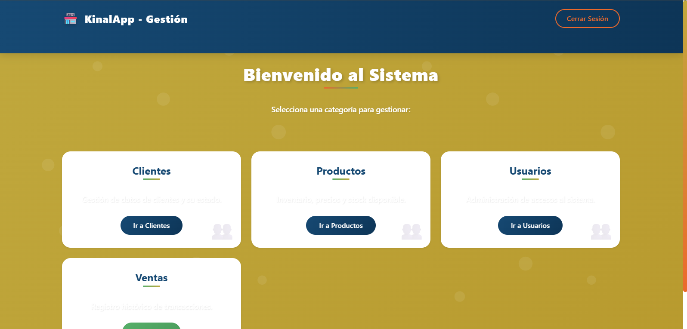
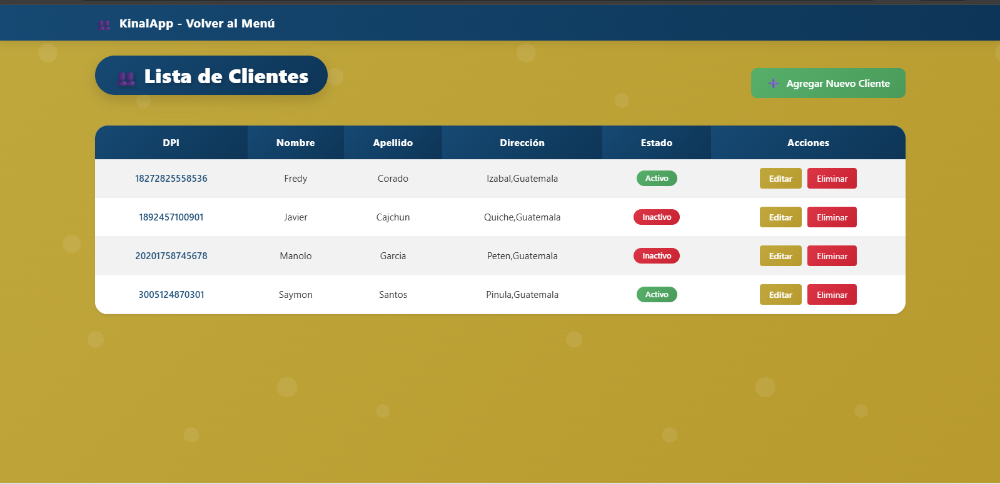
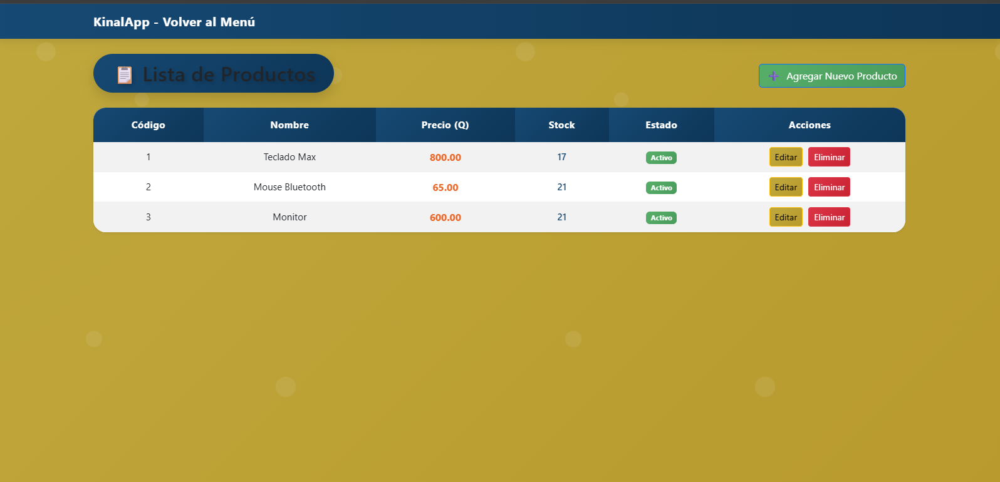
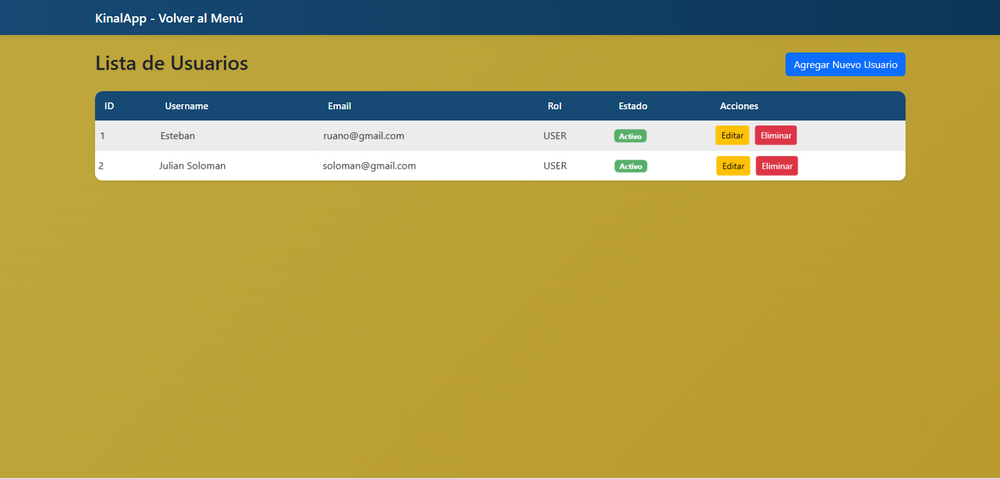
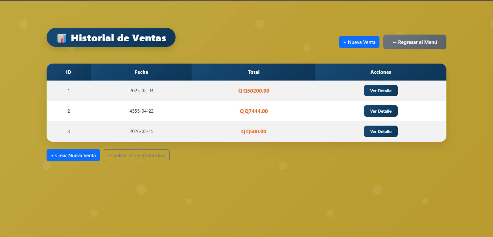

# KinalApp

KinalApp es una aplicación web desarrollada en Java con Spring Boot, 
diseñada para gestionar un sistema de ventas que incluye usuarios, clientes, 
productos, ventas y detalles de venta.

En esta nueva versión, el sistema ha sido mejorado con una interfaz gráfica, 
permitiendo una interacción más intuitiva mediante páginas web dinámicas desarrolladas 
con HTML, CSS y plantillas.

## Backend

* **Arquitectura basada en el patrón MVC (Modelo - Vista - Controlador).**
* **Implementación de operaciones CRUD para:**
* **Maven (Gestor de dependencias)
* Usuarios 
* Clientes
* Productos
* Ventas
* Detalle de ventas
* Uso de Spring Boot para la configuración y ejecución del servidor.
* Persistencia de datos mediante repositorios.


## Frontend

* Interfaz gráfica desarrollada con:
* HTML5
* CSS3
* Plantillas dinámicas (Thymeleaf)
* Vistas organizadas por módulos:
* Usuarios
* Clientes
* Productos
* Ventas
* Detalles
* Pantallas implementadas:
* Login
* Registro de usuarios
* Menú principal
* Formularios para agregar y editar datos
* Listados en tablas
* Estilos personalizados en archivos .css para cada sección.

## Estructura del Proyecto
````
kinalapp/ 
├── src/main/java/com/jesussanchez/kinalapp/ 
│     ├── controller/       # Controladores (manejo de rutas) 
│     ├── entity/           # Clases modelo (entidades) 
│     ├── repository/       # Acceso a datos 
│     └── KinalAppApplication.java
│  
├── src/main/resources/ 
│   ├── templates/          # Vistas HTML (Thymeleaf) 
│   ├── static/             # Archivos CSS e imágenes 
│   └── application.properties
│
├── img/    # Imágenes del sistema (evidencias) 
├── pom.xml     # Dependencias Maven 
└── README.md
`````

## Funcionalidades del Sistema

* Autenticación
* Inicio de sesión
* Registro de usuarios
* Gestión de Usuarios
* Crear, listar, editar y eliminar usuarios
* Gestión de Clientes
* Registro y administración de clientes
* Gestión de Productos
* Agregar, editar, listar y eliminar productos
* Gestión de Ventas
* Registro de ventas
* Asociación con clientes y productos
* Detalle de Ventas
* Visualización de productos vendidos por cada venta

## Tecnologias utilizadas 
* **Java 21**
* **SpringBoot 4**
* Maven (Gestor de dependencias)
* Thymeleaf
* HTML5
* CSS3
* **MySQL** (Sistema Gestor de Base de Datos)

## Requisitos Previos
Antes de ejecutar la aplicacion, debe teber instalado: 
* JDK 17 o superior 
* Maven Instalado
* Una instancia activa en MySQL

## Ejecución del Proyecto 

* 1.Clonar el repositorio:
git clone <url-del-repositorio>
* 2.Abrir el proyecto en tu IDE (IntelliJ recomendado).

* 3.Configurar la base de datos en:
application.properties

* 4.Ejecutar la clase principal:
KinalAppApplication.java

* 5.Acceder desde el navegador:
http://localhost:9090

Properties
# Configuración de la base de datos
* spring.datasource.url=jdbc:mysql://localhost:3306/kinalapp_in5am?serverTimezone=UTC
* spring.datasource.username=tu_usuario_mysql
* spring.datasource.password=tu_contraseña_mysql

# Puerto de la aplicación
server.port=9090

## Mejoras Implementadas
* Integración completa del frontend con el backend
* Mejora en la experiencia del usuario
* Navegación mediante menú principal
* Separación clara entre lógica y presentación
* Estilización personalizada por módulo

## Imagenes

## Login 


## Registro


## Menu principal



## Clientes



## Productos



## Usuarios



## Ventas




